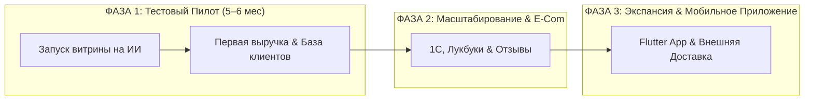

# ДРАФТ ПРЕЗЕНТАЦИИ ДЛЯ БИЗНЕСА И ЛПР (TREND ISLAND)
## E-Commerce витрина Click & Collect для универмага локальных брендов

---

## СЛАЙД 1. Какую главную задачу решает проект? (Бизнес-ценность)

1. **Старт онлайн-продаж с нуля и рост общей выручки Trend Island:**
   У Trend Island сейчас нет онлайн-продаж (0%). Мы запускаем новый цифровой канал продаж «с низкой базы в космос», превращая посетителей сайта в покупателей оффлайн-стойки в ТЦ «Авиапарк» (Click & Collect) и увеличивая общую выручку без расходов на курьерскую доставку.
2. **Безопасная проверка гипотезы (5 млн ₽ против десятков миллионов):**
   * **Боль рынка:** Классическая разработка E-Commerce с нуля требует десятков миллионов рублей, при этом нет никакой гарантии, что бизнес-модель выстрелит.
   * **Наше решение:** Передовые AI-технологии разработки (Vibe Coding) + глубокая практическая экспертиза нашей команды. Это позволяет проверенно запустить полноценный торговый пилот **всего за 5 млн рублей** без финансовых рисков.
3. **Единое кассовое ядро и оцифровка покупателей:**
   Покупатель собирает в 1 корзину товары любых брендов-резидентов. Чеки пробиваются от единого юрлица Trend Island, а бренд мгновенно формирует собственную базу оцифрованных клиентов.
4. **Ключевое решение боли: ЛК брендов + контроль TI:**
   Бренды в личных кабинетах сами ведут каталог и остатки. TI обеспечивает финальную витрину и надзор (единый fashion-стандарт, публикация, резервы, SLA) — без зоопарка карточек и хаоса остатков.


---

## СЛАЙД 2. Итерационный запуск: Фаза 1 (Пилот) $\rightarrow$ Фаза 2 $\rightarrow$ Фаза 3



### 🚀 ФАЗА 1: Тестовый Пилот (Быстрый запуск и проверка гипотезы)
* **Срок:** **5–6 месяцев** (технологическая разработка и тестирование IT-платформы).
* **Инвестиции:** **5 010 000 руб.** *(фиксация «под ключ», включая AI-инфраструктуру)*.
* **Что получает Trend Island в Фазе 1:**
  * **Премиальный Fashion-сайт на Nuxt 3 (Vue 3):** стильная витрина для покупателей (поиск по товарам и брендам, понятные фильтры, авто-обработка фото 3:4 под единый глянец).
  * **Фокусный пилот на 3–5 брендов:** на старт достаточно данных нескольких резидентов для обкатки процессов.
  * **Личные кабинеты брендов (каталог + остатки) + Telegram:** бренд сам ведёт ассортимент и availability; TI нормализует витрину. Заказ — мгновенно на смартфон, вещь — на стойку.
  * **Авто-уведомление покупателя:** клиент получает SMS/Email: *«Заказ №123 готов на стойке в Авиапарке, ждем вас на примерку!»* и спешит в ТЦ.
  * **Рабочее место на стойке в «Авиапарке»:** сотрудник Trend Island в пару кликов принимает вещи от брендов, проверяет маркировки («Честный ЗНАК») и передает в ИМ для пробития чека.
  * **Удобная оплата:** «Оплата при получении после примерки» или онлайн-оплата с «заморозкой» средств на карте до выдачи.
  * **Защита от фейков и сбор базы:** верификация покупателей по номеру телефона в 1 клик.

---

### 📈 ФАЗА 2: Автоматизация & Персонализация (После первых продаж)
* **Срок:** **3.5–4.5 месяца**.
* **Инвестиции:** **1 440 000 – 3 540 000 руб.** *(вилка зависит от готовности 1С)*.
* **Что подключается во 2-й фазе:**
  * **Выгрузка продаж в 1С:** автоматическая передача выкупленных чеков в 1С универмага.
  * **Программа Лояльности Trend Island:** списание и начисление бонусов прямо на витрине.
  * **Отзывы и оценка товаров (UGC):** инструмент сбора реальных фото и обратной связи от покупателей.
  * **Персонализация & Товарные рекомендации (Retail Rocket):** умный подбор выпадающих рекомендаций («С этим товаром покупают»).
  * **Интерактивные Лукбуки:** красивые съемки коллекций с кликабельными товарами (Shopping Tags).
  * **SEO-автогенератор:** авто-привлечение бесплатного поискового трафика из Яндекса.

---

### 🚀 ФАЗА 3: Экспансия & Мобильное Приложение (Масштабирование бизнеса)
* **Срок:** **4–5 месяцев**.
* **Инвестиции:** **2 430 000 – 3 600 000 руб.**
* **Что подключается в 3-й фазе:**
  * **Кроссплатформенное Мобильное Приложение на Flutter (iOS / Android):**
    * Единый код Flutter вместо дорогой двойной нативной разработки.
    * Пуш-уведомления (удешевление коммуникации с клиентами до 0 ₽).
    * Гео-пуши при входе в ТЦ «Авиапарк» + QR-карта вызова заказа на стойке.
  * **Умный AI-поиск Meilisearch:** мгновенный поиск (<20 мс) с защитой от опечаток.
  * **Экспресс-доставка Курьерами (Ship-from-Store):** масштабирование витрины на всю Москву с доставкой за 2–4 часа через Я.Доставку / СДЭК.

---

## СЛАЙД 3. Юнит-экономика и потенциал дополнительной выручки (ROI для ЛПР)

> **Исходный трафик сайта (SimilarWeb):** 45 000 – 50 000 визитов/мес (пик 61 000).  
> **Текущая онлайн-выручка от Click & Collect:** **0 ₽ / мес** (трафик не монетизируется).  
> **Еком-бенчмарк Fashion Click & Collect:** Средний чек (AOV) ~8 500 ₽, Конверсия выкупа на стойке ~80%.

| Этап развития | Трафик (Визиты / Сессии в мес) | Конверсия в заказ (CR) | Выкупленных чеков в мес | Средний чек (AOV) | **Дополнительная Онлайн-Выручка** | **Окупаемость этапа (ROI)** |
|---|:---:|:---:|:---:|:---:|:---:|:---:|
| **ФАЗА 1: Lean MVP** *(Месяцы 1–6)* | **50 000 – 60 000** | **1.0%** | **400 – 480 чеков** | **8 500 ₽** | **3.4 – 4.1 млн ₽ / мес** <br> *(~20–25 млн ₽ за 6 мес)* | **Полная окупаемость пилота (5.01 млн ₽) за 2–3 месяца!** |
| **ФАЗА 2: Масштабирование** *(Месяцы 6–9)* | **85 000 – 110 000** *(SEO + Рассылки)* | **1.6%** *(Retail Rocket)* | **1 115 – 1 440 чеков** | **9 000 ₽** | **10.0 – 13.0 млн ₽ / мес** <br> *(~40–50 млн ₽ за этап)* | **Кратный рост LTV и маржинальности** |
| **ФАЗА 3: Экосистема & Flutter App** *(Месяцы 10–14)* | **150 000 – 200 000** *(Веб + App MAU)* | **2.8%** *(App CR ~4.0%)* | **3 570 – 4 760 чеков** | **9 500 ₽** | **34.0 – 45.0 млн ₽ / мес** <br> *(~400–500 млн ₽ в год!)* | **Трансформация в крупнейшую витрину локальных брендов** |

---

## СЛАЙД 4. Прозрачная структура бюджета по Фазам

```
+-------------------------------------------------------------------------+
| ФАЗА 1: Тестовый Пилот / Lean MVP (5–6 месяцев)                         |
| • Fashion UX/UI Дизайн (Figma UI-Kit)                   :   780 000 ₽   |
| • Публичная Fashion-витрина для покупателей (Frontend)  : 1 320 000 ₽   |
| • Торговое ядро, Кабинеты брендов, Бот & OTP (Backend)  : 1 560 000 ₽   |
| • АРМ Стойки выдачи в «Авиапарке», Кассы и ЧЗ           :   540 000 ₽   |
| • Проектное управление, Аналитика и QA-гарантии         :   660 000 ₽   |
| • Запас на AI-инфраструктуру и нейросетевые лицензии     :   150 000 ₽   |
| СТОИМОСТЬ ПИЛОТА (ФАЗА 1 ПОД КЛЮЧ)                      : 5 010 000 ₽   |
+-------------------------------------------------------------------------+
| ФАЗА 2: Масштабирование & Автоматизация (3.5–4.5 мес)   : 1.44–3.54 млн ₽ |
| (1С, Программа Лояльности, Retail Rocket, Отзывы, SEO, SLA)            |
+-------------------------------------------------------------------------+
| ФАЗА 3: Экосистема & Экспансия (4–5 месяцев)             : 2.43–3.60 млн ₽ |
| (Flutter App iOS/Android, AI-поиск, Экспресс-доставка, B2B-портал)      |
+-------------------------------------------------------------------------+
| ОБЩИЙ ПОТЕНЦИАЛ ПЛАТФОРМЫ (ФАЗЫ 1 + 2 + 3)              : 8.88–12.15 млн ₽|
+-------------------------------------------------------------------------+
```

---

## СЛАЙД 5. Почему этот подход выгоден?

1. **Мгновенный старт продаж на имеющемся трафике (45-50k визитов):**
   Trend Island не нужно тратить миллионы на закупку первичного трафика — 50 000 человек уже приходят на сайт каждый месяц. Запуск витрины сразу превращает этот трафик в 3.4–4.1 млн ₽ дополнительной ежемесячной выручки.
2. **Окупаемость пилота за 2–3 месяца:**
   Инвестиции в Lean MVP (5.01 млн ₽) окупаются уже в первой четверти работы благодаря высокой конверсии Click & Collect и среднему чеку 8 500 ₽.
3. **Мгновенное накопление и оцифровка клиентской базы:**
   Витрина сразу начинает собирать контакты реальных покупателей, оцифровывать их предпочтения и формировать собственную базу Trend Island (CDP/CRM) для повторных продаж.
4. **Безопасность инвестиций благодаря AI + Экспертизе:**
   Использование AI-конвейера (Vibe Coding) экономит около **30% бюджета** на разработку. Бизнес получает продукт уровня топовых ритейлеров без переплат IT-агентствам.

---

## СЛАЙД 6. Следующие шаги для старта

1. **Утверждение бюджета и выбор 3–5 пилотных брендов для старта.**
2. **Подписание договора и старт этапа дизайна в Figma (Месяцы 1–2).**
3. **Техническая разработка, тестирование в «Авиапарке» и запуск (Месяцы 5–6).**
