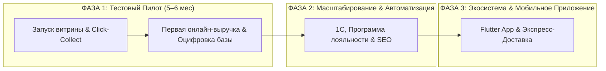

# ДРАФТ ПРЕЗЕНТАЦИИ ДЛЯ РУКОВОДСТВА (TREND ISLAND)
## E-Commerce витрина Click & Collect для универмага локальных брендов

---

## СЛАЙД 1. Какую ключевую боль бизнеса мы решаем?

### 🎯 Главный операционный вызов Trend Island:
Универмаг объединяет **десятки независимых локальных брендов-резидентов**. У Trend Island **нет единого общего склада и единой системы 1С** для товаров всех брендов. 
Запуск стандартного E-Commerce в таких условиях обычно приводит к операционному хаосу: *зоопарку разнородных карточек товаров, неактуальным остаткам, продаже вещей, которых нет на стойке (oversell), и срыву сроков выдачи*.

### 💡 Наше ключевое системное решение:

```
+-----------------------------------------------------------------------------------+
|  1. БРЕНДЫ = SOURCE OF TRUTH (Операционный контур остатков)                      |
|  Резиденты в Личных Кабинетах и Telegram-боте сами ведут каталог, карточки и      |
|  определяют актуальное наличие (availability) на стойке.                             |
+-----------------------------------------------------------------------------------+
                                         │
                                         ▼
+-----------------------------------------------------------------------------------+
|  2. TREND ISLAND = CONTROL PLANE & MASTER ВИТРИНЫ (Контур контроля)              |
|  Платформа автоматически нормализует фото (стандарт 3:4), проверяет замеры в см,  |
|  контролирует публикацию карточек и отслеживает SLA сборки (рейтинг бренда).      |
+-----------------------------------------------------------------------------------+
                                         │
                                         ▼
+-----------------------------------------------------------------------------------+
|  3. ЕДИНОЕ КАССОВОЕ ЯДРО & CLICK & COLLECT (Контур выдачи и 54-ФЗ)               |
|  Покупатель собирает 1 корзину из любых брендов. Бренды приносят вещи на стойку   |
|  в «Авиапарке». Сотрудник TI сканирует «Честный ЗНАК» через АРМ, пробивает 1 чек |
|  от юрлица TI при выдаче, клиент мерит и выкупает.                                |
+-----------------------------------------------------------------------------------+
```

---

## СЛАЙД 2. Стратегические бизнес-задачи проекта

1. **Запуск цифрового канала продаж и монетизация 50k веб-трафика:**
   У Trend Island в настоящее время 0% онлайн-продаж (45k–50k посетителей сайта в месяц сгорают). Проект конвертирует этот трафик в примерки и выкупы на стойке в ТЦ «Авиапарк» (Click & Collect), увеличивая выручку без затрат на курьерскую логистику.
2. **Обогащение профилей клиентов данными из онлайна:**
   Trend Island начинает обогащать профили своих клиентов качественными данными из онлайн-канала (история просмотров на витрине, предпочитаемые бренды, составы корзин) для последующей более глубокой и персонализированной работы на уровне коммуникации, триггерного маркетинга и программы лояльности.
3. **Безопасная валидация гипотезы (контролируемые инвестиции):**
   * **Рыночный вызов:** Полномасштабная разработка E-Commerce с нуля требует десятков миллионов рублей и интеграции десятков ERP-систем без гарантии окупаемости.
   * **Наше решение:** Применение AI-инструментов ускоренной разработки (Vibe Coding) + глубокая отраслевая экспертиза. Это позволяет запустить полноценный торговый пилот **всего за 5,46 млн рублей** с минимальными рисками.
4. **Единое кассовое ядро и оцифровка чеков:**
   Чеки фискализируются от единого юрлица Trend Island (комиссионная схема 54-ФЗ), обеспечивая прозрачный взаиморасчет с резидентами.

---

## СЛАЙД 3. Этапы реализации: Фаза 1 (Пилот) $\rightarrow$ Фаза 2 $\rightarrow$ Фаза 3



### 🚀 ФАЗА 1: Тестовый Пилот (Быстрый запуск и валидация модели)
* **Срок:** **5–6 месяцев** (технологическая разработка и операционное тестирование платформы).
* **Инвестиции:** **5 460 000 руб.** *(фиксация стоимости «под ключ», включая AI-инфраструктуру на 6 месяцев)*.
* **Результаты Фазы 1 для Trend Island:**
  * **Премиальный Fashion-сайт на Nuxt 3 (Vue 3):** витрина для покупателей (быстрый поиск PostgreSQL FTS, фильтры, 3:4 image pipeline, мобильный чекаут).
  * **Фокусный пилот на 3–5 ключевых брендов:** обкатка регламентов сборки и передача вещей на стойку.
  * **Личные кабинеты брендов (каталог + остатки) + Telegram-бот:** резиденты сами ведут остатки; заказ мгновенно летит в TG-бот бренд-менеджеру.
  * **Авто-уведомление покупателя:** SMS/Email: *«Заказ №123 готов на стойке в Авиапарке, ждем вас на примерку!»*.
  * **АРМ стойки выдачи в «Авиапарке»:** веб-интерфейс администратора TI для приемки вещей от брендов, сканирования «Честного ЗНАКА» и пробития 54-ФЗ чека.
  * **Удобные сценарии оплаты:** бронирование с оплатой при получении после примерки или онлайн-эквайринг с холдированием средств.
  * **OTP-верификация:** защита от фейков по номеру телефона (Flash-Call / Yandex ID).

---

## СЛАЙД 4. Юнит-экономика и финансовый потенциал (Консервативный расчет)

> **Исходный трафик сайта (SimilarWeb):** 45 000 – 50 000 визитов/мес.  
> **Текущая онлайн-выручка от Click & Collect:** **0 ₽ / мес** (трафик не монетизируется).  
> **Отраслевой бенчмарк Fashion Click & Collect:** Средний чек (AOV) ~8 500 ₽, Конверсия выкупа на стойке ~75-80%.

| Этап развития | Трафик (Визиты в мес) | Конверсия в заказ (CR) | Выкупленных чеков в мес | Средний чек (AOV) | **Прогнозируемая Онлайн-Выручка** | **Окупаемость этапа** |
|---|:---:|:---:|:---:|:---:|:---:|:---:|
| **ФАЗА 1: Тестовый Пилот** *(Месяцы 1–6)* | **50 000 – 60 000** | **0.6% – 0.8%** *(3–5 брендов)* | **225 – 384 чека** | **8 500 ₽** | **1.9 – 3.26 млн ₽ / мес** <br> *(~11.5–19.5 млн ₽ за 6 мес)* | **Окупаемость инвестиций пилота (5.46 млн ₽) за 4–6 месяцев** |
| **ФАЗА 2: Масштабирование** *(Месяцы 6–9)* | **85 000 – 110 000** *(SEO + Рассылки)* | **1.4% – 1.6%** | **975 – 1 408 чеков** | **9 000 ₽** | **8.7 – 12.6 млн ₽ / мес** | **Стабильный рост LTV и маржинальности** |
| **ФАЗА 3: Экосистема** *(Месяцы 10–14)* | **150 000 – 200 000** *(Веб + App MAU)* | **2.2% – 2.6%** | **2 805 – 4 420 чеков** | **9 500 ₽** | **26.6 – 41.9 млн ₽ / мес** | **Масштабирование в лидирующую онлайн-платформу** |

> ⚠️ **Важное примечание:** *Приведенные показатели юнит-экономики и сроки окупаемости являются расчетной финансовой моделью и достижимы ТОЛЬКО при условии полного соблюдения Дорожной карты проекта: выполнении брендами-резидентами регламента SLA по сборке товаров, обеспечении маркетинговой поддержки со стороны универмага и полнообъемной реализации всех запланированных модулей платформы.*

---

## СЛАЙД 5. Структура бюджета проекта по Фазам

```
+-------------------------------------------------------------------------+
| ФАЗА 1: Тестовый Пилот (5–6 месяцев)                                    |
| • Fashion UX/UI Дизайн (Figma UI-Kit)                   :   780 000 ₽   |
| • Публичная витрина + ЛК Брендов + АРМ Стойки (Frontend): 1 620 000 ₽   |
| • Торговое ядро, База данных, Кассы & OTP (Backend)     : 1 560 000 ₽   |
| • АРМ Стойки выдачи, Кассы 54-ФЗ и Честный ЗНАК          :   540 000 ₽   |
| • Проектное управление, Аналитика и QA-гарантии (PM/BA) :   660 000 ₽   |
| • AI-инфраструктура (50 тыс. ₽ / мес × 6 месяцев)       :   300 000 ₽   |
| ИТОГО ФАЗА 1 (ПИЛОТ ПОД КЛЮЧ)                           : 5 460 000 ₽   |
+-------------------------------------------------------------------------+
| ФАЗА 2: Масштабирование & Автоматизация (3.5–4.5 мес)   : 1.44–3.54 млн ₽ |
| (1С, Программа Лояльности, Retail Rocket, Отзывы, SEO)                  |
+-------------------------------------------------------------------------+
| ФАЗА 3: Экосистема & Экспансия (4–5 месяцев)             : 2.43–3.60 млн ₽ |
| (Flutter App iOS/Android, ИИ-сервис поиска / Elasticsearch, Экспресс-доставка) |
+-------------------------------------------------------------------------+
| ОБЩИЙ ПОТЕНЦИАЛ ПЛАТФОРМЫ (ФАЗЫ 1 + 2 + 3)              : 9.33–12.60 млн ₽|
+-------------------------------------------------------------------------+
```

---

## СЛАЙД 6. Ключевые преимущества предлагаемого подхода

1. **Мгновенное решение проблемы отсутствия учета у резидентов:**
   Вместо сложных интеграций с 1С каждого отдельного бренда мы даем им удобный интуитивный ЛК и TG-бот. Бренды сами являются source of truth по своему стоку.
2. **Обогащение клиентских профилей данными из онлайна:**
   Платформа аккумулирует глубокие цифровые данные о действиях покупателей на витрине, формируя качественные профили клиентов для последующего удерживающего маркетинга и роста LTV.
3. **Монетизация существующего веб-трафика (45 000 - 50 000 визитов):**
   Trend Island использует уже существующий органический трафик сайта без необходимости первичных масштабных затрат на привлечение. Запуск Click & Collect витрины конвертирует этот трафик в 1.9–3.26 млн ₽ дополнительной ежемесячной выручки на старте.
4. **Безопасная окупаемость в пределах 4–6 месяцев:**
   Консервативные инвестиции в пилот (5.46 млн ₽) обеспечивают быструю возвратность капитала благодаря высокой конверсии самовывоза с примеркой и среднему чеку 8 500 ₽.

---

## СЛАЙД 7. Следующие шаги для старта

1. **Согласование бюджета и утверждение списка 3–5 пилотных брендов-резидентов.**
2. **Подписание договора и проведение этапа UX/UI дизайна в Figma (Месяцы 1–2).**
3. **Техническая разработка, комплексное тестирование в ТЦ «Авиапарк» и запуск (Месяцы 5–6).**
