## СЛАЙД 1. Титульный слайд

# TREND ISLAND  
# x  
# E-COMMERCE  

*План цифровой трансформации и запуска каналов онлайн-продаж Click & Collect*

---
**Кадацкий Илья**  
*E-commerce эксперт | 2026*

---

## СЛАЙД 2. Проблемы и текущие ограничения бизнеса

### 🚨 Текущие ограничения оцифровки Trend Island:

1. **Веб-трафик сайта не монетизируется (0% онлайн-выручки):**
   Ежемесячно на сайт Trend Island заходит **45 000 – 50 000 посетителей**, однако из-за отсутствия товарного каталога и возможности покупки этот трафик сгорает впустую.
2. **Профили клиентов не обогащаются данными из онлайна:**
   Покупатели в оффлайн-зале остаются относительно «анонимными». Без онлайн-витрины невозможно отследить истории просмотров, отложенные вещи, интерес к конкретным брендовым категориям и цифровой след клиента.
3. **Ограниченность цифрового арсенала маркетинга (Следствие п. 1 и п. 2):**
   Отсутствие витрины и оцифрованных профилей блокирует применение эффективных e-com инструментов: перформанс-рекламы на конкретные товары, ретаргетинга, брошенных корзин, триггерных рассылок и персонализированных рекомендаций.
4. **Упущенный «диванный» трафик и географические барьеры:**
   Покупатели в вечернее время, в выходные или проживающие в отдаленных районах Москвы не готовы ехать в ТЦ «Авиапарк» «наугад», не имея гарантии наличия нужной вещи и размера.

---

### 📉 Негативные бизнес-последствия для Trend Island:

* **Прямая потеря выручки:** Покупатель, не найдя каталог на сайте, уходит за локальными брендами на сторонние маркетплейсы или сайты конкурентов.
* **Медленный рост и слабая глубина работы с клиентской базой:** Без сквозной аналитики и онлайн-данных сложно растить LTV и частоту повторных покупок.
* **Высокая зависимость от оффлайн-трафика ТЦ «Авиапарк»:** Выручка универмага напрямую завязана на внешний пешеходный трафик ТЦ, погоду, сезонность и транспортную доступность Ходынки.

---

## СЛАЙД 3. Что мешает традиционному развитию онлайна?

### 🚧 Специфика формата универмага и барьеры роста:

1. **Формат универмага и отсутствие единого склада:**
   В Trend Island торгуют десятки независимых брендов-резидентов. Единого центра информации о товарах, ценах и остатках не существует — актуальные стоки знает только бренд на своей точке.
2. **Сложность и дороговизна классического IT-подхода:**
   Создание единого IT-центра «под ключ» традиционным путем требует десятков миллионов рублей инвестиций (20–30 млн ₽), сложнейшей интеграции с 1С каждого резидента и формирования отдельной штатной e-commerce команды.
3. **Разнородность систем учета у брендов-резидентов:**
   У каждого резидента свой уровень автоматизации: от собственных 1С/МойСклад до учета в Excel. Заставить десятки резидентов синхронно провести интеграцию по API в сжатые сроки физически невозможно.
4. **Риск неактуальных остатков (Oversell) и стандарта контента:**
   При ручном или несинхронизированном ведении остатков возникает риск продажи отсутствующего товара, а также зоопарк разнородных любительских фотографий, разрушающих премиальный fashion-визуал витрины.

---

## СЛАЙД 4. Решение: Поэтапный запуск Lean MVP и платформа управления

```
+-----------------------------------------------------------------------------------+
|  1. БРЕНДЫ = SOURCE OF TRUTH (Операционный контур)                                |
|  Резиденты сами ведут каталог, цены и остатки через Личный Кабинет или Excel/YML  |
+-----------------------------------------------------------------------------------+
                                         │
                                         ▼
+-----------------------------------------------------------------------------------+
|  2. TREND ISLAND = CONTROL PLANE & MASTER ВИТРИНЫ (Контур контроля)              |
|  Авто-нормализация фото (3:4), замеры в см, модерация, SLA сборки (TG-бот)        |
+-----------------------------------------------------------------------------------+
                                         │
                                         ▼
+-----------------------------------------------------------------------------------+
|  3. CLICK & COLLECT + ЕДИНОЕ КАССОВОЕ ЯДРО (Контур выдачи и 54-ФЗ)               |
|  Выдача в ТЦ «Авиапарк», 1 чек от TI, сканирование «Честный ЗНАК», начисление ПЛ  |
+-----------------------------------------------------------------------------------+
```

### 🚀 Архитектура решения на Фазе 1 (Lean MVP):
* **Личные кабинеты брендов (ЛК):** Резиденты самостоятельно ведут ассортимент, остатки и цены через простой веб-интерфейс, YML-фиды или стандартные Excel-таблицы.
* **Стандартизация и надзор Trend Island:** Платформа автоматически нормализует фото под единый fashion-стандарт (Image Pipeline 3:4), верифицирует карточки и контролирует SLA сборки заказов через Telegram-бот.
* **Модель Click & Collect (Без курьерских затрат):** Покупатель собирает в 1 корзину товары любых брендов, оформляет заказ и прилетает на примерку на стойку в ТЦ «Авиапарк».
* **Единое кассовое ядро и 54-ФЗ:** Все продажи пробиваются от юрлица Trend Island. При сканировании 2D-кодов DataMatrix на стойке выбытие из «Честного ЗНАКА» происходит автоматически.
* **Интеграция с Программой Лояльности (ПЛ):** На Фазе 1 — регистрация клиентов и начисление бонусов на стойке в ручном/полуавтоматическом режиме (с полной автоматизацией на чекауте в Фазе 2).
* **Безопасная оплата:** Двухстадийный эквайринг (холдирование средств до выдачи) или бронь с оплатой после примерки.

---

## СЛАЙД 5. Что получает Trend Island (Бизнес-ценность)

1. **Запуск онлайн-продаж Click & Collect без роста оп-расходов:**
   Мгновенная монетизация 50 000 посетителей сайта. Модель не каннибализирует оффлайн-продажи, а привлекает сомневающихся покупателей в Авиапарк и генерирует **допродажи в зале (In-Store Cross-sell до +30-40% к чеку)**.
2. **Обогащение профилей клиентов & Фундамент для CDP:**
   Оцифровка цифрового следа покупателей (история просмотров, любимые бренды, состав корзин). База для внедрения CDP/CRM и запуска персонализированных триггерных рассылок.
3. **Прозрачность 54-ФЗ, маркировки и комиссионного учета:**
   Единое кассовое ядро гарантирует 100% юридическую чистоту, автоматический вывод маркировки «Честный ЗНАК» через ОФД и прозрачную отчетность перед брендами-резидентами.
4. **Быстрая валидация гипотезы и прозрачные инвестиции:**
   * **Рыночный вызов:** Полномасштабный e-commerce с нуля требует 20–30 млн ₽ без гарантий окупаемости.
   * **Наше решение:** Запуск полноценного пилота за **5,46 млн рублей за 5–6 месяцев** за счет ИИ-инструментов разработки (Vibe Coding) и глубокой отраслевой экспертизы команды.

---

## СЛАЙД 6. Схема фаз и Дорожная карта развития платформы

```mermaid
flowchart LR
    subgraph F1["ФАЗА 1: Тестовый Пилот (5–6 мес)"]
        A1["Nuxt 3 Витрина & ЛК Брендов"] --> A2["АРМ Стойки & Click-Collect"]
        A2 --> A3["Первая онлайн-выручка (5.46 млн ₽)"]
    end
    
    subgraph F2["ФАЗА 2: Масштабирование & LTV (3.5–4.5 мес)"]
        A3 --> B1["Автоматизация 1С & ПЛ"]
        B1 --> B2["Товарные рекомендации & UGC"]
        B2 --> B3["Shoppable Лукбуки & SEO"]
    end

    subgraph F3["ФАЗА 3: Экосистема & Экспансия (4–5 мес)"]
        B3 --> C1["Flutter App iOS / Android"]
        C1 --> C2["ИИ-поиск / Elasticsearch"]
        C2 --> C3["Экспресс-доставка Курьерами"]
    end
```



---

## СЛАЙД 7. Сроки, детализация фаз и инвестиции

### 🚀 ФАЗА 1: Тестовый Пилот / Lean MVP (Месяцы 1–6)
* **Срок:** **5–6 месяцев**.
* **Инвестиции:** **5 460 000 руб.** *(стоимость «под ключ», включая AI-инфраструктуру на 6 месяцев)*.
* **Функциональный состав:**
  * **Премиальный Fashion-сайт на Nuxt 3 (Vue 3):** листинги, быстрый поиск PostgreSQL FTS, фильтры, карточки товаров (PDP), ЛК покупателя, корзина, мобильный чекаут, справочные разделы (доставка/оплата), персональная страница бренда с его каталогом.
  * **Пилот на 3–4 ключевых брендах:** обкатка регламентов сборки и передачи товаров на стойку.
  * **Личные кабинеты брендов (ЛК) + Telegram-бот:** управление каталогом, остатками и ценами; моментальные TG-алерты о новых заказах.
  * **Система уведомлений покупателей:** SMS/Email статусы заказа + триггерная цепочка готовности к выдаче.
  * **АРМ стойки выдачи в «Авиапарке»:** веб-интерфейс администратора TI для приемки заказов, сканирования «Честного ЗНАКА», регистрации в ПЛ и фискализации чека.
  * **Сценарии оплаты:** бронирование с оплатой при получении или онлайн-оплата с холдированием средств.
  * **OTP-авторизация:** регистрация по номеру телефона (SMS, Flash-Call, Yandex ID).

---

### 📈 ФАЗА 2: Автоматизация, Рекомендации & LTV (Месяцы 6–9)
* **Срок:** **3.5–4.5 месяца**.
* **Инвестиции:** **1 440 000 – 3 540 000 руб.**
* **Функциональный состав:**
  * **Интеграция с учетной системой 1С:** асинхронная выгрузка выкупленных чеков и комиссии для бухгалтерии.
  * **Программа Лояльности на чекауте:** списывание и начисление бонусов прямо в корзине.
  * **Товарные рекомендации (Retail Rocket / Mindbox):** умные блоки рекомендаций (*«С этим товаром покупают»*, *«Похожие модели»*).
  * **Отзывы и UGC:** модуль пользовательских фото и оценок товаров.
  * **Интерактивные Shoppable Лукбуки:** подборки от стилистов TI с кликабельными товарами (Shopping Tags).
  * **SEO-автогенератор:** авто-создание индексируемых страниц категорий под поисковые запросы.
  * **Каскадный SLA & Авто-рейтинг брендов:** ранжирование товаров в выдаче на основе скорости сборки резидентами.

---

### 🚀 ФАЗА 3: Экосистема & Omnichannel Экспансия (Месяцы 10–14)
* **Срок:** **4–5 месяцев**.
* **Инвестиции:** **2 430 000 – 3 600 000 руб.**
* **Функциональный состав:**
  * **Мобильное Приложение на Flutter (iOS / Android):** единый код, 60–120 fps UX, пуш-уведомления, гео-пуши при входе в ТЦ «Авиапарк», QR-карта вызова заказа.
  * **Умный поиск (Elasticsearch / OpenSearch или внешние ИИ-сервисы):** семантический ИИ-поиск по масштабному каталогу.
  * **Экспресс-доставка Курьерами (Ship-from-Store):** доставка заказов из Авиапарка курьерами (Яндекс Доставка / СДЭК) за 2–4 часа по всей Москве.

> ℹ️ **Примечание по оценкам Фаз 2 и 3:** *Разброс оценок бюджетов и трудозатрат на Фазах 2 и 3 связан с тем, что для уточнения сметы требуется проведение этапа предпроектного обследования — детальное изучение внутренних бизнес-процессов Заказчика, архитектуры учетной системы 1С и механик действующей Программы Лояльности.*

---

## СЛАЙД 8. Команда проекта & AI-технологический стек (Vibe Coding)

### 👥 Компактная экспертная группа:
* **Кадацкий Илья (E-Commerce эксперт / PM / BA):** Руководство продуктом, системная аналитика, управление сроками, контроль качества и операционная синхронизация с Trend Island.
* **Lead Fashion UX/UI Дизайнер:** Проектирование премиального внешнего вида витрины в Figma, UI-Kit, fashion-анимаций и мобильного UX.
* **Senior Fullstack Инженеры (Вайбкодеры):** Опытные разработчики (Nuxt 3 + Laravel/PostgreSQL), работающие в прямой связке с ИИ-инструментами.
* **QA & DevOps Инженер:** Комплексное ручное и автоматическое тестирование, CI/CD, серверный контур и безопасность РФ (Yandex Cloud, SmartCaptcha, DDOS-Guard).

---

### 🤖 Наш AI-технологический стек и среды разработки (Vibe Coding):
Разработка ведется с использованием современного AI-конвейера, что сокращает сроки производства на **30%** и исключает расходы на раздутый штат посредников.

```
+-----------------------------------------------------------------------------------+
|  AI IDE & СРЕДЫ РАЗРАБОТКИ                                                        |
|  • Google Antigravity (AGY)  |  • Cursor AI IDE                                   |
+-----------------------------------------------------------------------------------+
                                         │
                                         ▼
+-----------------------------------------------------------------------------------+
|  ФЛАГМАНСКИЕ НЕЙРОСЕТЕВЫЕ LLM-ДВИЖКИ                                              |
|  • Anthropic Claude 3.5 Sonnet  |  • Google Gemini Pro  |  • OpenAI GPT-4o        |
+-----------------------------------------------------------------------------------+
                                         │
                                         ▼
+-----------------------------------------------------------------------------------+
|  ИИ-АГЕНТЫ И АВТОМАТИЗАЦИЯ                                                        |
|  • Авто-генерация интеграционных тестов  |  • Авто-документирование API             |
|  • Ускоренная нормализация YML/Excel-фидов и фото-контента (Image Pipeline)       |
+-----------------------------------------------------------------------------------+
```

---

## СЛАЙД 9. Юнит-экономика и финансовый потенциал (Консервативный расчет)

> **Исходный трафик сайта (SimilarWeb):** 45 000 – 50 000 визитов/мес.  
> **Текущая онлайн-выручка:** **0 ₽ / мес**.  
> **Бенчмарки Fashion Click & Collect:** AOV ~8 500 ₽, Выкуп на стойке ~75-80%.

| Этап развития | Трафик (Визиты в мес) | Конверсия в заказ (CR) | Выкупленных чеков в мес | Средний чек (AOV) | **Прогнозируемая Онлайн-Выручка** | **Окупаемость инвестиций** |
|---|:---:|:---:|:---:|:---:|:---:|:---:|
| **ФАЗА 1: Lean MVP** *(Месяцы 1–6)* | **50 000 – 60 000** | **0.6% – 0.8%** *(3–4 бренда)* | **225 – 384 чека** | **8 500 ₽** | **1.9 – 3.26 млн ₽ / мес** <br> *(~11.5–19.5 млн ₽ за 6 мес)* | **Полная окупаемость пилота (5.46 млн ₽) за 4–6 месяцев!** |
| **ФАЗА 2: Масштабирование** *(Месяцы 6–9)* | **85 000 – 110 000** *(SEO + Рассылки)* | **1.4% – 1.6%** *(Retail Rocket)* | **975 – 1 408 чеков** | **9 000 ₽** | **8.7 – 12.6 млн ₽ / мес** | **Стабильный рост LTV и маржинальности** |
| **ФАЗА 3: Экосистема** *(Месяцы 10–14)* | **150 000 – 200 000** *(Веб + App MAU)* | **2.2% – 2.6%** *(App CR ~3.5%)* | **2 805 – 4 420 чеков** | **9 500 ₽** | **26.6 – 41.9 млн ₽ / мес** | **Масштабирование в лидирующую онлайн-платформу** |

> ⚠️ **Важное примечание:** *Приведенные показатели юнит-экономики и сроки окупаемости являются расчетной финансовой моделью и достижимы ТОЛЬКО при условии полного соблюдения Дорожной карты проекта: выполнении брендами-резидентами регламента SLA по сборке товаров, обеспечении маркетинговой поддержки со стороны универмага и полнообъемной реализации всех запланированных модулей платформы.*
