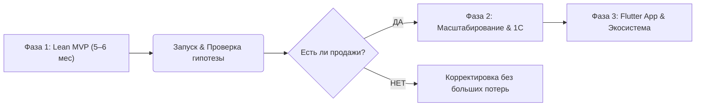
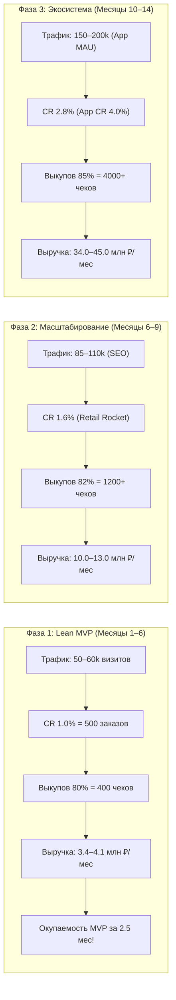
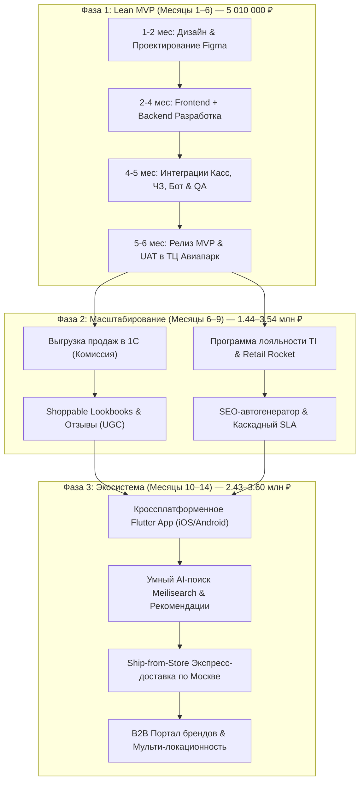

# ТЕХНИЧЕСКОЕ ПРЕДЛОЖЕНИЕ И СМЕТА ПРОЕКТА
## E-Commerce витрина Click & Collect для универмага локальных брендов «Trend Island»

---

## 1. Концепция проекта и Стратегия Lean MVP (Проверка гипотезы)

### Бизнес-концепция
Создание единой интернет-витрины универмага **Trend Island (ТЦ «Авиапарк», Москва)** с моделью продаж **Click & Collect** (онлайн-заказ -> сборка брендами -> единая стойка выдачи и примерки в ТЦ). 

Универмаг выступает единым кассовым ядром (договор комиссии/реализации). Все чеки пробиваются от юрлица TI. У Trend Island на старте 0% онлайн-продаж, поэтому цель проекта — запустить цифровой канал продаж «с низкой базы в космос» и привлекать онлайн-трафик на оффлайн-стойку примерки в ТЦ без затрат на курьерскую доставку.


### Ключевое решение: ЛК брендов + контроль TI

Боль клиента — не «сделать сайт», а **управляемый каталог и остатки** при десятках резидентов без единого склада в 1С.

* **Бренды** в личных кабинетах сами ведут свой каталог и остатки (SKU, размеры, цены, фото, availability) — это их операционный контур.
* **Trend Island / платформа** — финальная реализация витрины и надзор: единый fashion-стандарт (карточки, 3:4, атрибуты), правила публикации, резервы и заказы, контроль качества данных и SLA.
* **Итог:** бренды = source of truth по своему стоку и ассортименту; TI = master витрины, заказа и control plane. Без зоопарка карточек и без хаоса oversell.

### Главный страх Заказчика и Стратегия Lean MVP
> **Опасение Заказчика:** *"Взлетит ли гипотеза omnichannel-продаж в универмаге? Будут ли бренды вовремя приносить вещи на стойку, а покупатели — приходить за ними?"*

Чтобы не тратить миллионные бюджеты на непроверенную гипотезу, проект делится на **3 фазы**:



#### 🚀 Фаза 1: Lean MVP (Запуск за 5–6 месяцев / 20–24 недели) — Проверка гипотезы
**Цель:** Качественно запустить витрину с фокусом на 3–5 пилотных брендов (с расширением до топ-20 резидентов) и проверить операционный SLA сборки.
* **Каталог и остатки:** Личные кабинеты брендов (каталог + availability) + импорт YML/Excel; TI нормализует витрину и контролирует публикацию. Без сложных кастомных трансформеров на старте.
* **Оплата:** Простой онлайн-эквайринг (холдирование средств) + вариант «Оплата при получении после примерки» (бронь).
* **Стойка выдачи:** Упрощенное веб-АРМ для администратора стойки TI (приемка от бренда, сканирование маркировки DataMatrix, передача кодов в ИМ для централизованной фискализации).
* **Уведомления:** Telegram-бот для брендов (алерт о заказе со временем на сборку) + SMS/Email покупателю с кодом выдачи (*«Заказ №123 готов на стойке в Авиапарке!»*).
* **Дизайн (Fashion-уровень):** Премиальная кастомная витрина в Figma с упором на эстетику, мобильный UX и микроанимации.

---

## 2. Ключевые технические и юридические нюансы

### 1. Маркировка «Честный ЗНАК» и 54-ФЗ (Централизованная схема через API ИМ)
* **Как работает:** Вывод товара из оборота происходит **автоматически через ОФД** при фискализации чека «Полный расчет».
* **Техническая реализация (по согласованию с Team Lead):** 
  1. **АРМ стойки выдачи / ТСД:** Сотрудник при выдаче сканирует 2D-коды DataMatrix (Честный ЗНАК) на вещах.
  2. **Передача кодов в ИМ:** АРМ передает сканированные коды маркировки вместе с фактом выдачи в бэкенд Интернет-Магазина (ИМ).
  3. **Пробитие чека:** Бэкенд ИМ дергает API кассового сервиса (Атол Онлайн / CloudKassir), пробивая чек **«Полный расчет»** с передачей кода маркировки (тег `1163`) и агентских тегов 54-ФЗ (ИНН бренда-поставщика).
  4. **Авто-вывод из ОФД:** Кассовый сервис через ОФД автоматически списывает марку в ГИС МТ «Честный ЗНАК».
  5. **Двухстадийные чеки:** При оплате/брони на сайте — чек «Предоплата» (без марки); при фактической выдаче на стойке — чек «Полный расчет» (с маркой).

### 2. Премиальный Fashion UI/UX & Обработка контента (Image Pipeline)
Fashion-сегмент требователен к визуалу: никаких шаблонных админок на публичном фронтенде.
* **Автоматический Image Pipeline (3:4):** Все фото из YML-фидов и ЛК брендов автоматически масштабируются бэкендом к единому пропорциональному стандарту **3:4** с авто-добавлением фоновых полей (`#F5F5F7`) и генерацией плавно размытых Blur-скелетонов.
* **Интерактивный Cropper.js:** В ЛК бренда встроен инструмент визуального кадрирования при загрузке фото.
* **Точные обмерные данные в см (Size Guide):** Чтобы снизить процент отмен после примерки, в карточку товара добавляется вкладка «Таблица размеров и замеры» с точными параметрами вещи (обхват груди/талии/бедер, длина в см).

### 3. Защита по законам РФ (152-ФЗ) и OTP-авторизация
* **РФ-стек безопасности:** Замена иностранного Cloudflare на **Yandex SmartCaptcha** (сертифицирована в РФ, защита без ввода капчи по клику) + **DDOS-Guard** на уровне DNS.
* **Обязательная OTP-авторизация при чекауте:**
  ```mermaid
  flowchart LR
      A[Клиент жмет Забронировать] --> B[Ввод номера телефона]
      B --> C{Способ OTP}
      C -- Flash-Call --> D[Звонок-сброс: последние 4 цифры]
      C -- Yandex / VK ID --> E[Авторизация в 1 клик]
      C -- SMS --> F[Код из SMS]
      D & E & F --> G[Профиль создан + Заказ оформлен]
  ```
  * Использование **Flash-Call** (звонок-сброс за ~0.40 ₽) и **Yandex/VK ID** (0 ₽) для экономии бюджета на SMS в 10 раз.
  * Ограничение: не более **2 активных броней** на 1 подтвержденный номер телефона для защиты склада от фейков.

---

## 3. Архитектура и Технологический Стек Проекта

Для обеспечения бескомпромиссной скорости, премиального fashion-визуала, высокой конверсии и 100% надежности в РФ-контуре зафиксирован следующий стек технологий:

### 🛠️ Сводная таблица стека по слоям платформы

| Слой платформы | Выбранная технология / Сервис | Назначение и инженерное обоснование |
|---|---|---|
| **Публичная витрина (Frontend)** | **Nuxt 3 (Vue 3)** + **Vanilla CSS** | Нативный SSR (Server-Side Rendering) для идеальной индексации Яндексом (SEO), 100/100 LCP/TTFB, микроанимации и эксклюзивный бионический дизайн без тяжелых фреймворков. |
| **Торговое ядро (Backend API)** | **Laravel (PHP 8.2+)** + **REST API** | Высокая скорость разработки (Vibe Coding), ORM Eloquent, строгая бизнес-логика заказов, бронирования, двустадийных чеков и комиссионного учета. |
| **База данных (Database)** | **PostgreSQL** | Настоящие ACID-транзакции, транзакционные блокировки остатков (`SELECT FOR UPDATE`), надежное хранение заказов, клиентов, товаров и кодов маркировки. |
| **Фоновые очереди & Кэш** | **Redis** + **Laravel Horizon** | Асинхронная обработка фоновых задач: парсинг YML-фидов, авто-масштабирование фото (3:4 Pipeline), отправка SMS/Telegram-уведомлений, push выкупленных продаж в 1С. |
| **АРМ Стойки выдачи / ТСД** | **Упрощенное веб-приложение** | Веб-АРМ для администратора в ТЦ «Авиапарк»: сканирование DataMatrix (Честный ЗНАК), приемка от брендов, отправка кодов в ИМ для централизованной фискализации. |
| **Кассы и 54-ФЗ (Фискализация)** | **CloudKassir / Атол Онлайн API** | Авто-пробитие чеков «Предоплата» (на сайте) и «Полный расчет» (с тегом 1163 ЧЗ) через ОФД при вручении товара на стойке. |
| **Безопасность & Авторизация (РФ)** | **Yandex SmartCaptcha** + **DDOS-Guard** | Сертифицированная РФ-защита от ботов и ddos без раздражающего ввода капчи клиентом. |
| **Оптимизация OTP-авторизации** | **Flash-Call** (0.40 ₽) + **Yandex ID / VK ID** (0 ₽) | Сокращение расходов на авторизацию в 10 раз (вместо дорогого SMS за 4-5 ₽). |
| **Уведомления резидентам** | **Telegram Bot API** | Моментальные push-алерты брендам-поставщикам на смартфон о новых заказах со временем на сборку. |
| **Мобильное приложение (Фаза 3)** | **Flutter (iOS & Android)** | Единый кроссплатформенный стек (экономия 50% бюджета по сравнению с двойным нативом), 60–120 fps UX, Face ID, Гео-пуши в ТЦ, QR-карта. |
| **Умный поиск (Фаза 3)** | **Meilisearch** | Мгновенный поиск search-as-you-type (<20 мс) с устойчивостью к опечаткам и раскладке. |
| **Маркетинг & Рекомендации (Фаза 2)** | **Retail Rocket / Mindbox** | Персонализированные товарные рекомендации (*«С этим товаром покупают»*), триггерные рассылки и программа лояльности. |

---

## 4. Юнит-экономика и финансовый потенциал проекта (ROI для бизнеса)

### Исходные параметры монетизации трафика (SimilarWeb baseline)
* **Текущий веб-трафик (SimilarWeb):** **45 000 – 50 000 визитов / мес** (пиковый показатель до **61 000 визитов / мес**).
* **Текущая онлайн-выручка от Click & Collect:** **0 ₽ / мес** *(органический трафик заходит на инфо-сайт, но не имеет инструмента покупки)*.
* **Бенчмарк среднего чека (AOV) в универмаге TI:** **8 500 ₽ – 9 500 ₽** *(премиум-сегмент локальных брендов)*.
* **Бенчмарк конверсии в выкуп (Click & Collect):** **80%** *(покупатель лично выбирает и прилетает на примерку на 3 этаж ТЦ «Авиапарк»)*.

---

### 📊 Моделирование финансового потенциала и окупаемости по фазам



### 📈 Детальный расчет юнит-экономики:

| Показатель / Метрика | Фаза 1: Lean MVP (Месяцы 1–6) | Фаза 2: Масштабирование (Месяцы 6–9) | Фаза 3: Flutter App & Экосистема (Месяцы 10–14) |
|---|:---:|:---:|:---:|
| **Объем трафика (визиты / сессии в мес)** | **50 000 – 60 000** | **85 000 – 110 000** *(SEO + Рассылки)* | **150 000 – 200 000** *(Веб + Flutter App MAU)* |
| **Конверсия витрины в заказ (CR)** | **1.0%** *(Базовый чекаут)* | **1.6%** *(Retail Rocket + Отзывы)* | **2.8%** *(Средневзвешенный, App CR ~4.0%)* |
| **Количество оформленных заказов / мес** | **500 – 600** | **1 360 – 1 760** | **4 200 – 5 600** |
| **Конверсия выкупа на стойке (Click & Collect)** | **80%** | **82%** | **85%** *(включая курьерскую экспресс-доставку)* |
| **Количество выкупленных чеков / мес** | **400 – 480** | **1 115 – 1 440** | **3 570 – 4 760** |
| **Средний чек выкупа (AOV)** | **8 500 ₽** | **9 000 ₽** *(Cross-sell в лукбуках)* | **9 500 ₽** *(Рекомендации + Комплекты)* |
| **ДОПОЛНИТЕЛЬНАЯ ОНЛАЙН-ВЫРУЧКА / МЕС** | **3.4 – 4.1 млн ₽ / мес** | **10.0 – 13.0 млн ₽ / мес** | **34.0 – 45.0 млн ₽ / мес** |
| **Суммарный доход за этап** | **~20.4 – 24.6 млн ₽** *(за 6 мес)* | **~40.0 – 52.0 млн ₽** *(за 4 мес)* | **~408.0 – 540.0 млн ₽ / год** |
| **ОКУПАЕМОСТЬ ЭТАПА (ROI)** | **Окупаемость 5.01 млн ₽ за 2.5 мес!** | **Маржинальная окупаемость за 1.5 мес** | **Выход на лидирующую онлайн-платформу** |

---

## 5. Финансовая модель (Ставка 3 000 руб/час + Vibe Coding)

В разработке применяются **AI-инструменты (Vibe Coding)**: AI IDE (Cursor, AGY) и LLM-модели (Claude 3.5 Sonnet / Gemini Pro), что дает сокращение чистых часов разработки бэкенда на 25–30%.

* **Базовая ставка проекта:** **3 000 руб / час** *(обеспечивает высокий запас прочности)*.
* **Накладные расходы на AI-инфраструктуру (с запасом):** **150 000 руб** (на токены премиум-моделей Claude/OpenAI, командные подписки IDE и агенты на весь проект).

---

## 6. СМЕТА ПРОЕКТА: Версия 1 — Детальная по ролям (Ставка 3 000 ₽/час)

### Оценка трудозатрат и бюджета по ролям:

| Блок / Роль в проекте | Часы | Ставка | Итого (руб) | Доля в бюджете |
|---|:---:|:---:|:---:|:---:|
| **1. UI/UX Дизайн (Fashion Figma UI-Kit, Анимации)** | **260 ч** | 3 000 ₽ | **780 000 ₽** | 15.6% |
| **2. Frontend (Nuxt 3 Fashion Витрина + Image Pipeline)** | **440 ч** | 3 000 ₽ | **1 320 000 ₽** | 26.3% |
| **3. Backend (Laravel API, Парсеры, Кассы, ЧЗ, Бот, OTP)** | **520 ч** | 3 000 ₽ | **1 560 000 ₽** | 31.1% |
| **4. PM / Управление проектом & Аналитика (Ваш гонорар)** | **220 ч** | 3 000 ₽ | **660 000 ₽** | 13.2% |
| **5. QA & DevOps (Тестирование, CI/CD, Настройка серверов)** | **180 ч** | 3 000 ₽ | **540 000 ₽** | 10.8% |
| **6. AI-инфраструктура (Запас на токены, LLM, IDE)** | — | — | **150 000 ₽** | 3.0% |
| **ИТОГО ПО ПРОЕКТУ (Lean MVP)** | **1 620 ч** | **3 000 ₽** | **5 010 000 ₽** | **100%** |

---

## 7. СМЕТА ПРОЕКТА: Версия 2 — Бизнес-ориентированная (Для ЛПР / CEO)

```
+-------------------------------------------------------------------------+
| БЛОК 1: Премиальный Fashion UX/UI Дизайн (Figma)                        |
| Разработка эксклюзивного внешнего вида интернет-витрины: адаптивная     |
| сетка каталога, микроанимации, карточки товаров, мобильная версия.      |
| Стоимость: 780 000 руб.                                                 |
+-------------------------------------------------------------------------+
| БЛОК 2: Публичная Fashion-витрина и Каталог (Frontend)                  |
| Кастомный быстрый сайт для покупателей на Nuxt 3 (Vue 3): каталог SKUs, |
| авто-обработка фото (3:4), замеры в см, фильтры по цветам/размерам.    |
| Стоимость: 1 320 000 руб.                                               |
+-------------------------------------------------------------------------+
| БЛОК 3: Торговое ядро, ЛК брендов, OTP и Telegram-уведомления (Backend) |
| Импорт товаров (YML/Excel), личные кабинеты для резидентов, OTP по      |
| Flash-Call/Yandex ID, моментальные Telegram-алерты поставщикам.        |
| Стоимость: 1 560 000 руб.                                               |
+-------------------------------------------------------------------------+
| БЛОК 4: АРМ Стойки выдачи, «Честный ЗНАК» и Кассы (54-ФЗ)               |
| Рабочее место администратора в ТЦ «Авиапарк». Сканирование марок        |
| при выдаче, передача кодов в ИМ, пробитие чека полного расчета (тег 1163)|
| через облачный кассовый сервис ИМ, холдирование денег.                  |
| Стоимость: 540 000 руб. (включая QA/DevOps)                             |
+-------------------------------------------------------------------------+
| БЛОК 5: Проектное управление, Аналитика и Сопровождение (PM)            |
| Сопровождение проекта, системная аналитика, контроль сроков и качества.  |
| Стоимость: 660 000 руб.                                                 |
+-------------------------------------------------------------------------+
| AI-инфраструктура (Запас на токены и нейросетевых IDE)                  |
| Стоимость: 150 000 руб.                                                 |
+-------------------------------------------------------------------------+
```

### Итоговый бюджет Lean MVP (с запасом прочности): **5 010 000 руб.**
*Календарный срок реализации:* **5–6 месяцев (20–24 недели).**

---

## 8. Что еще НЕ УЧТЕНО (Операционные риски Заказчика)

1. **Юридический договор комиссии:** Ответственность бренда за несвоевременную доставку вещи на стойку выдачи.
2. **Оборудование на стойке выдачи:** ПК/планшет, 2D-сканер (DataMatrix), эквайринговый терминал.
3. **Маркетинг и трафик:** Бюджет на привлечение покупателей в онлайн-витрину.
4. **Служба поддержки:** Регламент обработки звонков и сообщений покупателей.

---

## 9. Детальная спецификация и вилка оценки Фазы 2: Масштабирование & Автоматизация (Месяцы 6–9)

**Цель:** Автоматизация выгрузки проведенных продаж в 1С, удержание покупателей (LTV), подключение маркетинговых интеграций и генерация органического SEO-трафика после успешного запуска Lean MVP.

### Подробный состав модулей Фазы 2:

#### 1. Выгрузка продаж в учетную систему 1С (УТ / ERP / КА)
* **Асинхронный Push продаж в 1С:** Передача завершенных заказов (выкупленных товаров на стойке) и возвратов из ИМ в 1С универмага для комиссионного учета и выплат резидентам.
* **Шина очередей (Queue Workers):** Отправка данных через фоновые очереди (Redis / Laravel Horizon) без риска замедления витрины или чекаута.
* **Оценка:** **80 – 400 ч** | **240 000 – 1 200 000 ₽** *(вилка зависит от готовности REST API / OData со стороны 1С Заказчика)*.

#### 2. Программа Лояльности & Товарные Рекомендации (CDP / Mindbox / Retail Rocket)
* **Персонализация & Товарные рекомендации (Retail Rocket):** Умные алгоритмы рекомендаций (*«С этим товаром покупают»*, *«Похожие модели»*, подборки на основе истории просмотров и совместных чеков).
* **Единый профиль покупателя & Бонусы:** Объединение истории покупок онлайн и офлайн, начисление и списание баллов в корзине с OTP-подтверждением.
* **Персонализированные триггеры и рассылки:** Триггерные сообщения (брошенная корзина, брошенный просмотр товара, персональный подбор к дню рождения).
* **Оценка:** **80 – 400 ч** | **240 000 – 1 200 000 ₽**.

#### 3. Отзывы, Оценка товаров и UGC (Обратная связь)
* **Модуль сбора отзывов:** Оценка купленных товаров покупателями после получения и примерки заказа.
* **Покупательский контент (UGC):** Загрузка реальных фотографий вещей от покупателей в отзывы, модерация в ЛК администратора.
* **Рейтинги товаров:** Виджеты рейтинга (звезды), сортировка отзывов и вывод средней оценки в карточку товара и каталог.
* **Оценка:** **60 – 80 ч** | **180 000 – 240 000 ₽**.

#### 4. Интерактивные Лукбуки & Shoppable Content (Shopping Tags)
* **Fashion-сеты и стилизованные лукбуки:** Раздел с готовыми стилистическими подборками от стилистов Trend Island.
* **Shoppable Tags:** Кликабельные интерактивные метки на фотографиях лукбука с всплывающим превью конкретного товара (название, цена, размеры, кнопка добавления в корзину).
* **Быстрая покупка образов:** Возможность добавить в корзину как отдельную вещь из образа, так и весь лук целиком в 1 клик.
* **Оценка:** **120 ч** | **360 000 ₽**.

#### 5. SEO-автогенератор посадочных страниц (Dynamic SEO Landing)
* **Генератор низкочастотных страниц:** Автоматическое создание семантических страниц категорий под поисковые запросы (например, *«черные шелковые платья Trend Island»*, *«льняные рубашки локальных брендов»*).
* **Динамические SEO-метаданные:** Авто-генерация уникальных `<h1>`, `Title`, `Meta Description`, `canonical` URL и микроразметки Schema.org / Open Graph для соцсетей.
* **Индексируемая фильтрация:** Индексация страниц фильтров по брендам, цветам, материалам и сезонам.
* **Оценка:** **80 – 100 ч** | **240 000 – 300 000 ₽**.

#### 6. Каскадный SLA & Авто-рейтинг брендов-резидентов
* **Контроль сборки заказов резидентами:** Автоматические таймеры обратного отсчета на сборку вещей брендами после выгрузки заказа.
* **Пуш-напоминания и эскалация:** Автоматические уведомления менеджеру TI и администратору при нарушении регламентного времени сборки бренд-резидентом.
* **Рейтинг надежности брендов:** Автоматическое ранжирование карточек товаров в выдаче каталога на основе показателя оперативного SLA бренда (скорость сборки, % брака, % отмен).
* **Оценка:** **60 – 80 ч** | **180 000 – 240 000 ₽**.

---

### 💰 Сводная вилка оценки Фазы 2 (при ставке 3 000 ₽/час)

| № | Модуль Фазы 2 | Часы | Стоимость (в рублях) |
|---|---|:---:|:---:|
| **1** | **Выгрузка продаж в учетную систему 1С** *(комиссионный учет)* | 80 – 400 ч | 240 000 – 1 200 000 ₽ |
| **2** | **Программа Лояльности & Рекомендации Retail Rocket** | 80 – 400 ч | 240 000 – 1 200 000 ₽ |
| **3** | **Отзывы, Оценка товаров и UGC** *(обратная связь)* | 60 – 80 ч | 180 000 – 240 000 ₽ |
| **4** | **Интерактивные Лукбуки** *(Shopping Tags)* | 120 ч | 360 000 ₽ |
| **5** | **SEO-генератор авто-категорий** *(посадочные страницы)* | 80 – 100 ч | 240 000 – 300 000 ₽ |
| **6** | **Каскадный SLA & Авто-рейтинг брендов** | 60 – 80 ч | 180 000 – 240 000 ₽ |
| **ИТОГО** | **Вилка Фазы 2 (3.5 – 4.5 мес)** | **480 – 1 180 ч** | **1 440 000 – 3 540 000 ₽** |

---

## 10. Детальная спецификация и вилка оценки Фазы 3: Экосистема & Omnichannel Экспансия (Месяцы 10–14)

**Цель:** Превращение витрины в ведущую e-commerce платформу локальных брендов с максимальной конверсией, собственным мобильным приложением, умными персональными рекомендациями и экспансией на новые локации.

### Подробный состав модулей Фазы 3:

#### 1. Кроссплатформенное Мобильное Приложение TI (iOS / Android на Flutter)
* **Единый кроссплатформенный стек (Flutter):** Вместо двойной разработки двух отдельных нативных приложений на Swift и Kotlin разработка ведется на Flutter. Это дает экономию 50% времени и бюджета с сохранением нативной производительности (60–120 fps) и единым кодом под iOS и Android.
* **Нативный мобильный UX & Биометрия:** Быстрая работа приложения, поддержка Face ID / Touch ID, нижний таб-бар, жесты fashion-витрины.
* **Гео-пуши & Пуш-уведомления:** Push-уведомления при приближении к ТЦ «Авиапарк» (*«Ваш заказ №1240 готов к примерке на 3 этаже!»*), анонсы закрытых распродаж без затрат на SMS.
* **QR-карта в приложении:** Персональный QR-код покупателя для моментальной идентификации и вызова заказа на стойке выдачи.
* **Оценка:** **350 – 500 ч** | **1 050 000 – 1 500 000 ₽**.

#### 2. Умный поиск и AI-рекомендации (Meilisearch / Personalization Engine)
* **Search-as-you-type поиск:** Поисковый движок по SKUs с мгновенным откликом (<20 мс), устойчивостью к опечаткам, раскладке клавиатуры и синонимам.
* **AI-блоки рекомендаций:** Алгоритмы персонализации: *«Вам может понравиться»* (на основе истории просмотров), *«Похожие вещи от других локальных брендов»*.
* **Оценка:** **140 – 200 ч** | **420 000 – 600 000 ₽**.

#### 3. Экспресс-доставка Курьерами по Москве (Ship-from-Store)
* **Интеграция с логистическими сервисами:** Прямая интеграция с Яндекс Доставкой, Достависта или CDEK.
* **Доставка за 2–4 часа из ТЦ «Авиапарк»:** Возможность курьерской доставки вещей прямо из универмага с возможностью быстрой примерки на дому.
* **Виджет отслеживания курьера:** Картографический виджет в ЛК и SMS с отслеживанием движения курьера в реальном времени.
* **Оценка:** **100 – 160 ч** | **300 000 – 480 000 ₽**.

#### 4. B2B Бренд-Портал & Авто-Аналитика Резидентов
* **Расширенный кабинет бренда:** Дашборды продаж резидента в универмаге, воронка конверсий карточек товаров, аналитика просмотров, примеряемости и отмен.
* **Авто-генерация Отчетов Комиссионера:** Автоматическое формирование формализованных актов сверки и отчетов комиссионера по 54-ФЗ для бухгалтерского учета брендов.
* **Прогнозирование спроса:** Рекомендации бэкенда брендам о том, какие модели, цвета и размеры следует довезти на стойку TI к выходным.
* **Оценка:** **120 – 180 ч** | **360 000 – 540 000 ₽**.

#### 5. Мульти-локационность (Сеть Универмагов / Новые ТЦ)
* **Поддержка нескольких физических точек (ТЦ Авиапарк, ТЦ Цветной и др.):** Переключение точек выдачи и стоек примерки на витрине.
* **Маршрутизация остатков по локациям:** Автоматическая привязка корзины и заказа к складу соответствующей физической точки.
* **Оценка:** **100 – 160 ч** | **300 000 – 480 000 ₽**.

---

### 💰 Сводная вилка оценки Фазы 3 (при ставке 3 000 ₽/час)

| № | Модуль Фазы 3 | Часы | Стоимость (в рублях) |
|---|---|:---:|:---:|
| **1** | **Мобильное приложение TI** *(Кроссплатформа на Flutter: iOS + Android)* | 350 – 500 ч | 1 050 000 – 1 500 000 ₽ |
| **2** | **Умный поиск & AI-рекомендации** *(Meilisearch)* | 140 – 200 ч | 420 000 – 600 000 ₽ |
| **3** | **Экспресс-доставка Курьерами по Москве** *(Ship-from-Store)* | 100 – 160 ч | 300 000 – 480 000 ₽ |
| **4** | **B2B Бренд-Портал & Авто-Отчеты Комиссионера** | 120 – 180 ч | 360 000 – 540 000 ₽ |
| **5** | **Мульти-локационность** *(Сеть универмагов / новые ТЦ)* | 100 – 160 ч | 300 000 – 480 000 ₽ |
| **ИТОГО** | **Вилка Фазы 3 (4 – 5 мес)** | **810 – 1 200 ч** | **2 430 000 – 3 600 000 ₽** |

---

## 11. Итоговый Календарный план-график и Общая вилка проекта (Фазы 1 + 2 + 3)



### 📊 Сводный бюджет проекта по всем этапам развития

| Этап / Фаза | Сроки | Часы | Бюджет (в рублях) | Назначение |
|---|:---:|:---:|:---:|---|
| **ФАЗА 1: Lean MVP** *(Фиксированный бюджет)* | **5–6 месяцев** | **1 620 ч** | **5 010 000 ₽** | Проверка гипотезы, витрина Nuxt 3, АРМ выдачи, ЧЗ, 54-ФЗ, бот |
| **ФАЗА 2: Масштабирование** *(Вилка)* | **3.5–4.5 мес** | **480 – 1 180 ч** | **1 440 000 – 3 540 000 ₽** | Выгрузка продаж в 1С, ПЛ, Retail Rocket, Отзывы, SEO, SLA |
| **ФАЗА 3: Экосистема** *(Вилка)* | **4–5 месяцев** | **810 – 1 200 ч** | **2 430 000 – 3 600 000 ₽** | Flutter Приложение (iOS+Android), AI-поиск, Курьеры, B2B-портал |
| **ОБЩИЙ ПОТЕНЦИАЛ ПРОЕКТА (Фазы 1 + 2 + 3)** | **12–15 месяцев** | **2 910 – 4 000 ч** | **8 880 000 – 12 150 000 ₽** | Полноценная E-Commerce платформа локальных брендов |