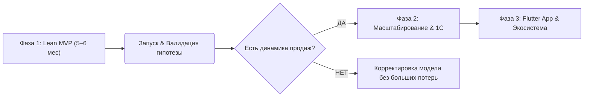

# ТЕХНИЧЕСКОЕ ПРЕДЛОЖЕНИЕ И СМЕТА ПРОЕКТА (ВЕРСИЯ v3)
## E-Commerce витрина Click & Collect для универмага локальных брендов «Trend Island»

---

## 1. Концепция проекта и Решение Ключевой Операционной Боли Заказчика

### 🎯 В чём ключевая боль клиента (Trend Island)?
Trend Island — это масштабный универмаг в ТЦ «Авиапарк» (4 000 кв.м), объединяющий **десятки независимых локальных брендов-резидентов**. 

**Главный операционный тупик при запуске классического E-Commerce:**
* У Trend Island **нет единого общего склада и единой системы 1С** для товаров всех брендов. Каждый бренд поставляет и ведет учет вещей автономно.
* Попытка «сделать обычный интернет-магазин» разбивается о проблемы: *Как собирать товары разных брендов в 1 корзину? Как избежать зоопарка плохих фотографий? Как не допустить продажи вещей, которых нет на стойке (oversell)? Как не сойти с ума, заставляя сотрудников Trend Island вручную обновлять остатки за десятки резидентов?*

---

### 💡 Как наша архитектура решает эту боль (Трехуровневая модель):

```
+-----------------------------------------------------------------------------------+
|  УРОВЕНЬ 1. БРЕНДЫ = SOURCE OF TRUTH (Операционный контур остатков)              |
|  Резиденты в Личных Кабинетах и Telegram-боте сами ведут свой каталог, карточки и |
|  определяют актуальное наличие (availability) вещей на стойке.                    |
+-----------------------------------------------------------------------------------+
                                         │
                                         ▼
+-----------------------------------------------------------------------------------+
|  УРОВЕНЬ 2. TREND ISLAND = CONTROL PLANE & MASTER ВИТРИНЫ (Контур контроля)       |
|  Платформа автоматически нормализует фото (стандарт 3:4), проверяет замеры в см,  |
|  контролирует правила публикации карточек и отслеживает SLA сборки (рейтинг).     |
+-----------------------------------------------------------------------------------+
                                         │
                                         ▼
+-----------------------------------------------------------------------------------+
|  УРОВЕНЬ 3. КОРЗИНА, ЧЕКАУТ, C&C И ШЛЮЗ С ERP                                     |
|  Покупатель собирает 1 корзину из любых брендов и бронирует заказ (без онлайн-    |
|  оплаты). Бренды приносят вещи на стойку. Клиент примеряет и оплачивает на        |
|  физической кассе TI; статусы заказа синхронизируются с ERP (канал E-com).        |
+-----------------------------------------------------------------------------------+
```

**Итог решения:** 
* Бренды мотивированы сами вести свой сток (ведь от этого зависят их продажи).
* Trend Island держит контроль над качеством витрины, единым стилем и качеством обслуживания клиентов.
* Покупатель получает удобный сервис покупки в 1 клик с примеркой в «Авиапарке».

---

## 2. Ключевые операционные вызовы и риски проекта

> **Вопрос Заказчика:** *"Насколько валидна гипотеза omnichannel-продаж в универмаге? Будут ли бренды вовремя передавать вещи на стойку, а покупатели — приходить за ними?"*

Чтобы рационально расходовать бюджет и поэтапно валидировать модель, проект разделен на **3 фазы**:



#### 🚀 Фаза 1: Lean MVP (Запуск за 5–6 месяцев / 20–24 недели) — Валидация модели
**Цель:** Качественно запустить витрину с фокусом на 3–5 пилотных брендов (с последующим расширением до топ-20 резидентов) и проверить операционный SLA сборки.
* **Каталог и остатки:** Личные кабинеты брендов (каталог + availability) + импорт YML/Excel; платформа нормализует витрину и контролирует публикацию.
* **Поиск:** Нативный высокоскоростной поиск на базе **PostgreSQL Full-Text Search (FTS)** + Laravel Scout.
* **Оплата (MVP):** Только «Оплата при получении после примерки» на физической кассе TI. Онлайн-эквайринг и облачная фискализация — вне Фазы 1.
* **Стойка выдачи:** Веб-АРМ администратора TI (приемка от бренда, статусы заказа, координация выдачи). Сканирование ЧЗ и пробитие чека — на кассе/ERP TI; веб-платформа синхронизирует статусы через шлюз с ERP.
* **Уведомления и Учет (Telegram-бот):** Телеграм-бот для брендов (алерт о заказе со временем на сборку, а также кнопка быстрого списания остатков при продаже товара в офлайне). СМС/Email покупателю с кодом выдачи (*«Заказ №123 готов на стойке!»*).
* **Дизайн (Fashion-уровень):** Премиальная кастомная витрина в Figma с упором на эстетику, мобильный UX и микроанимации.

---

## 3. Ключевые технические и юридические нюансы

### 1. Маркировка «Честный ЗНАК» и 54-ФЗ (Физическая касса TI + шлюз статусов с ERP)
В Фазе 1 **нет онлайн-оплаты** на сайте: клиент бронирует заказ, примеряет и платит на кассе TI.
* **Как работает:** Фискализация (чек полного расчета) и вывод марок «Честный ЗНАК» выполняются **на физическом кассовом контуре / ERP TI** — по регламенту розницы, с пометкой канала «E-com» для аналитики.
* **Техническая реализация:**
  1. **Идентификация:** Клиент называет код из СМС / показывает QR администратору на стойке.
  2. **Выдача и примерка:** АРМ веб-платформы ведёт статусы (собран → на стойке → выкуп / частичный выкуп / отмена / no-show).
  3. **Сканирование ЧЗ и чек:** На физической кассе / в ERP TI (как при офлайн-продаже).
  4. **Шлюз с ERP:** Веб-платформа передаёт/получает статусы заказа и факт выкупа для статистики; **не** бьёт облачный чек и **не** передаёт тег 1163 из веб-АРМ.
  5. **Фаза 2 (не Фаза 1):** Онлайн-эквайринг, холдирование, CloudKassir/Атол Онлайн, двухстадийные чеки «Предоплата → Полный расчет» с ЧЗ.

### 2. Премиальный Fashion UI/UX & Обработка контента (Image Pipeline)
Fashion-сегмент требователен к визуалу: никаких шаблонных решений на публичном фронтенде.
* **Автоматический Image Pipeline (3:4):** Все фото из YML-фидов и ЛК брендов автоматически масштабируются бэкендом к единому пропорциональному стандарту **3:4** с авто-добавлением фоновых полей (`#F5F5F7`) и генерацией плавно размытых Blur-скелетонов.
* **Интерактивный Cropper.js:** В ЛК бренда встроен инструмент визуального кадрирования при загрузке фото.
* **Точные обмерные данные в см (Size Guide):** Чтобы снизить процент отмен после примерки, в карточку товара добавляется вкладка «Таблица размеров и замеры» с точными параметрами вещи.

### 3. Защита по законам РФ (152-ФЗ) и OTP-авторизация
* **РФ-стек безопасности:** Замена иностранного Cloudflare на **Yandex SmartCaptcha** (сертифицирована в РФ, защита без ввода капчи по клику) + **DDOS-Guard** на уровне DNS.
* **Обязательная OTP-авторизация при чекауте:**
  ```mermaid
  flowchart LR
      A[Клиент жмет Забронировать] --> B[Ввод номера телефона]
      B --> C{Способ OTP}
      C -- Flash-Call --> D[Звонок-сброс: последние 4 цифры]
      C -- Yandex / VK ID --> E[Авторизация в 1 клик]
      C -- SMS --> F[Код из SMS]
      D & E & F --> G[Профиль создан + Заказ оформлен]
  ```
  * Использование **Flash-Call** (звонок-сброс za ~0.40 ₽) и **Yandex/VK ID** (0 ₽) для оптимизации расходов на SMS.
  * Ограничение: не более **2 активных броней** на 1 подтвержденный номер телефона для защиты склада от фейковых заказов.

---

## 4. Архитектура и Технологический Стек Проекта

Для обеспечения бескомпромиссной скорости, премиального fashion-визуала, высокой конверсии и 100% надежности в РФ-контуре зафиксирован следующий стек технологий:

### 🛠️ Сводная таблица стека по слоям платформы

| Слой платформы | Выбранная технология / Сервис | Назначение и инженерное обоснование |
|---|---|---|
| **Публичная витрина (Frontend)** | **Nuxt 3 (Vue 3)** + **Vanilla CSS** | Нативный SSR (Server-Side Rendering) для идеальной индексации Яндексом (SEO), 100/100 LCP/TTFB, микроанимации и эксклюзивный дизайн без тяжелых фреймворков. |
| **Торговое ядро (Backend API)** | **Laravel (PHP 8.2+)** + **REST API** | Бизнес-логика каталога, бронирования (OTP), статусов C&C, комиссионного учета и шлюза статусов с ERP TI. |
| **База данных & Поиск (Phase 1)** | **PostgreSQL** + **FTS (Full-Text Search)** | ACID-транзакции, блокировки остатков (`SELECT FOR UPDATE`), полнотекстовый поиск PostgreSQL FTS на стартовом каталоге без внешних зависающих сервисов. |
| **Фоновые очереди & Кэш** | **Redis** + **Laravel Horizon** | Асинхронная обработка задач: парсинг YML-фидов, авто-масштабирование фото, отправка SMS/Telegram-уведомлений. |
| **АРМ Стойки выдачи** | **Веб-приложение (Nuxt 3)** | Веб-АРМ администратора в ТЦ «Авиапарк»: приемка от брендов, статусы заказа, координация выдачи (без скана ЧЗ и без облачной кассы в MVP). |
| **Корзина, чекаут, шлюз ERP** | **Laravel API + интеграция ERP TI** | OTP-бронь, корзина/чекаут без онлайн-оплаты; синхронизация статусов и канала «E-com» с ERP TI. Фискализация и ЧЗ — на кассе TI. |
| **Безопасность & Авторизация (РФ)** | **Yandex SmartCaptcha** + **DDOS-Guard** | Сертифицированная РФ-защита от ботов и ddos без раздражающего ввода капчи клиентом. |
| **Оптимизация OTP-авторизации** | **Flash-Call** (0.40 ₽) + **Yandex ID / VK ID** (0 ₽) | Сокращение расходов на авторизацию в 10 раз (вместо SMS за 4-5 ₽). |
| **Уведомления и сток резидентам** | **Telegram Bot API** | Алерты о новых заказах (SLA сборки) + быстрое списание офлайн-продаж для актуализации остатков на витрине (1С TI остатки не хранит). |
| **Мобильное приложение (Фаза 3)** | **Flutter (iOS & Android)** | Единый кроссплатформенный стек (экономия 50% времени и бюджета по сравнению с нативным кодом), 60–120 fps UX, Face ID, Гео-пуши в ТЦ, QR-карта. |
| **Масштабируемый поиск (Фаза 3)** | **Elasticsearch** или **ИИ-агент** | Промышленный поисковый движок e-commerce или готовый ИИ-сервис умного поиска для работы с масштабным каталогом при расширении. |
| **Маркетинг & Рекомендации (Фаза 2)** | **Retail Rocket / Mindbox** | Персонализированные товарные рекомендации (*«С этим товаром покупают»*), триггерные рассылки и программа лояльности. |

---

## 5. Юнит-экономика и финансовый потенциал (Консервативный расчет)

### Исходные параметры монетизации трафика (SimilarWeb baseline)
* **Текущий веб-трафик (SimilarWeb):** **45 000 – 50 000 визитов / мес** (пиковый показатель до **61 000 визитов / мес**).
* **Текущая онлайн-выручка от Click & Collect:** **0 ₽ / мес** *(трафик заходит на инфо-сайт, но не имеет инструмента покупки)*.
* **Бенчмарк среднего чека (AOV) в универмаге TI:** **8 500 ₽ – 9 500 ₽** *(премиум-сегмент локальных брендов)*.
* **Бенчмарк конверсии в выкуп (Click & Collect):** **75% – 80%** *(покупатель лично прилетает на примерку на 3 этаж ТЦ «Авиапарк»)*.

---

### 📊 Моделирование финансового потенциала и окупаемости по фазам


### 📈 Детальный консервативный расчет юнит-экономики:

| Показатель / Метрика | Фаза 1: Lean MVP (Месяцы 1–6) | Фаза 2: Масштабирование (Месяцы 6–9) | Фаза 3: Flutter App & Экосистема (Месяцы 10–14) |
|---|:---:|:---:|:---:|
| **Объем трафика (визиты / сессии в мес)** | **50 000 – 60 000** | **85 000 – 110 000** *(SEO + Рассылки)* | **150 000 – 200 000** *(Веб + Flutter App MAU)* |
| **Конверсия витрины в заказ (CR)** | **0.6% – 0.8%** *(Пилот 3–5 брендов)* | **1.4% – 1.6%** *(Retail Rocket + Отзывы)* | **2.2% – 2.6%** *(Средневзвешенный, App CR ~3.5%)* |
| **Количество оформленных заказов / мес** | **300 – 480** | **1 190 – 1 760** | **3 300 – 5 200** |
| **Конверсия выкупа на стойке (Click & Collect)** | **75% – 80%** | **80%** | **85%** *(включая курьерскую экспресс-доставку)* |
| **Количество выкупленных чеков / мес** | **225 – 384** | **975 – 1 408** | **2 805 – 4 420** |
| **Средний чек выкупа (AOV)** | **8 500 ₽** | **9 000 ₽** *(Cross-sell в лукбуках)* | **9 500 ₽** *(Рекомендации + Комплекты)* |
| **ПРОГНОЗИРУЕМАЯ ОНЛАЙН-ВЫРУЧКА / МЕС** | **1,9 – 3,26 млн ₽ / мес** | **8,7 – 12,6 млн ₽ / мес** | **26,6 – 41,9 млн ₽ / мес** |
| **Суммарный доход за этап** | **~11,5 – 19,5 млн ₽** *(за 6 мес)* | **~34,8 – 50,4 млн ₽** *(за 4 мес)* | **~319,0 – 502,0 млн ₽ / год** |
| **ОКУПАЕМОСТЬ ЭТАПА** | **Окупаемость 5,46 млн ₽ за 4–6 месяцев** | **Стабильная маржинальная прибыль** | **Лидирующая онлайн-платформа** |

> ⚠️ **Важное примечание:** *Приведенные показатели юнит-экономики и сроки окупаемости являются расчетной финансовой моделью и достижимы ТОЛЬКО при условии полного соблюдения Дорожной карты проекта: выполнении брендами-резидентами регламента SLA по сборке товаров, обеспечении маркетинговой поддержки со стороны универмага и полнообъемной реализации всех запланированных модулей платформы.*

---

## 6. Финансовая модель (Ставка 3 000 руб/час + Vibe Coding)

В разработке применяются **AI-инструменты (Vibe Coding)**: AI IDE (Cursor, AGY) и LLM-модели (Claude 3.5 Sonnet / Gemini Pro), что дает сокращение чистых часов разработки бэкенда на 25–30%.

* **Базовая ставка проекта:** **3 000 руб / час**.
* **Накладные расходы на AI-инфраструктуру (с запасом):** **300 000 руб** (из расчета 50 000 руб/мес × 6 месяцев на токены премиум-моделей Claude/OpenAI, командные подписки IDE и ИИ-агентов).

### 👥 Состав команды проекта (Компактная экспертная группа):
* **E-Commerce эксперт & PM (Кадацкий Илья):** Руководство продуктом, системная аналитика, управление сроками, контроль качества и операционная синхронизация с Trend Island.
* **Lead Fashion UX/UI Дизайнер:** Проектирование премиального внешнего вида витрины в Figma, UI-Kit, fashion-анимаций и мобильного UX.
* **Senior Fullstack Инженеры (Вайбкодинг):** Команда разработки (Nuxt 3 + Laravel/PostgreSQL), использующая передовые AI-инструменты ускоренного кода (Cursor, AGY, Claude 3.5 Sonnet / Gemini Pro) для сокращения сроков и бюджета на 25-30%.
* **QA & DevOps Инженер:** Комплексное ручное и автоматическое тестирование, CI/CD, настройка серверов и РФ-контура безопасности (Yandex Cloud, SmartCaptcha, DDOS-Guard).

---

## 7. СМЕТА ПРОЕКТА: Версия 1 — Детальная по ролям (Ставка 3 000 ₽/час)

### Оценка трудозатрат и бюджета по ролям:

| Блок / Роль в проекте | Часы | Ставка | Итого (руб) | Доля в бюджете |
|---|:---:|:---:|:---:|:---:|
| **1. UI/UX Дизайн (Fashion Figma UI-Kit, Анимации)** | **260 ч** | 3 000 ₽ | **780 000 ₽** | 14.3% |
| **2. Frontend (Nuxt 3 Витрина + ЛК Брендов + АРМ Стойки)** | **540 ч** | 3 000 ₽ | **1 620 000 ₽** | 29.7% |
| *— Публичная витрина Nuxt 3 (Каталог, PDP, Сетки, Чекаут)* | *(320 ч)* | 3 000 ₽ | *(960 000 ₽)* | |
| *— Личные кабинеты брендов (Каталог, Остатки, Cropper.js)* | *(140 ч)* | 3 000 ₽ | *(420 000 ₽)* | |
| *— Веб-АРМ Стойки выдачи в «Авиапарке» (статусы, приёмка)* | *(80 ч)* | 3 000 ₽ | *(240 000 ₽)* | |
| **3. Backend (Laravel API, Парсеры, FTS, Корзина/чекаут, шлюз ERP, Бот, OTP)** | **520 ч** | 3 000 ₽ | **1 560 000 ₽** | 28.6% |
| **4. PM / Управление проектом & Аналитика (PM/BA)** | **220 ч** | 3 000 ₽ | **660 000 ₽** | 12.1% |
| **5. QA & DevOps (Тестирование, CI/CD, Настройка серверов)** | **180 ч** | 3 000 ₽ | **540 000 ₽** | 9.9% |
| **6. AI-инфраструктура (50 тыс. ₽/мес × 6 месяцев)** | — | — | **300 000 ₽** | 5.4% |
| **ИТОГО ПО ПРОЕКТУ (Lean MVP)** | **1 720 ч** | **3 000 ₽** | **5 460 000 ₽** | **100%** |

---

## 8. СМЕТА ПРОЕКТА: Версия 2 — Структурированная по бизнес-блокам

```
+-------------------------------------------------------------------------+
| БЛОК 1: Премиальный Fashion UX/UI Дизайн (Figma)                        |
| Разработка внешнего вида интернет-витрины: адаптивная сетка каталога,   |
| микроанимации, карточки товаров, мобильная версия.                      |
| Стоимость: 780 000 руб.                                                 |
+-------------------------------------------------------------------------+
| БЛОК 2: Публичная витрина, ЛК брендов и АРМ стойки (Frontend)            |
| Кастомный быстрый сайт для покупателей на Nuxt 3 (Vue 3): каталог SKUs, |
| авто-обработка фото (3:4), замеры в см, ЛК брендов для ведения остатков |
| и веб-АРМ администратора стойки в ТЦ «Авиапарк».                        |
| Стоимость: 1 620 000 руб. (включая детализацию по 3 модулям)            |
+-------------------------------------------------------------------------+
| БЛОК 3: Торговое ядро, Поиск PostgreSQL FTS, OTP и Бот (Backend)        |
| Импорт товаров (YML/Excel), OTP (Flash-Call/Yandex ID), PostgreSQL FTS, |
| Telegram-бот: алерты о сборке + списание офлайн-продаж (сток у брендов).|
| Стоимость: 1 560 000 руб.                                               |
+-------------------------------------------------------------------------+
| БЛОК 4: Бизнес-логика заказа, статусы C&C и шлюз с ERP                       |
| Бронь без онлайн-оплаты, жизненный цикл заказа, синхронизация статусов  |
| и канала «E-com» с ERP TI. Фискализация/ЧЗ — на кассе TI (вне веб-ИМ).  |
| Стоимость: 540 000 руб. (включая QA/DevOps)                             |
+-------------------------------------------------------------------------+
| БЛОК 5: Проектное управление, Аналитика и Сопровождение (PM/BA)         |
| Системная аналитика, управление сроками, контроль качества (QA).        |
| Стоимость: 660 000 руб.                                                 |
+-------------------------------------------------------------------------+
| AI-инфраструктура (50 000 руб / месяц × 6 месяцев)                      |
| Запас на токены LLM, командные подписки IDE и нейросетевые агенты.      |
| Стоимость: 300 000 руб.                                                 |
+-------------------------------------------------------------------------+
```

### Итоговый бюджет Lean MVP: **5 460 000 руб.**
*Календарный срок реализации:* **5–6 месяцев (20–24 недели).**

---

## 9. Дополнительные операционные риски Заказчика

1. **Юридический договор комиссии:** Ответственность бренда за несвоевременную доставку вещи на стойку выдачи.
2. **Оборудование на стойке выдачи:** ПК/планшет, 2D-сканер (DataMatrix), эквайринговый терминал.
3. **Маркетинг и трафик:** Бюджет на информирование аудитории и привлечение покупателей в онлайн-витрину.
4. **Служба поддержки:** Регламент обработки звонков и сообщений покупателей.

---

## 10. Детальная спецификация и вилка оценки Фазы 2: Масштабирование & Автоматизация (Месяцы 6–9)

**Цель:** Подключить **онлайн-оплату** (после валидации C&C на оплате при получении), автоматизировать выгрузку продаж в 1С, усилить LTV (лояльность, рекомендации, UGC) и SEO-трафик.

### Подробный состав модулей Фазы 2:

#### 0. Онлайн-оплата, эквайринг и облачная фискализация (54-ФЗ)
* **Онлайн-эквайринг:** Оплата картой на сайте (холдирование / списание) через ЮKassa / CloudPayments или аналог.
* **Облачная касса:** Чеки «Предоплата» при оплате на сайте; при выдаче — сценарий полного/частичного capture и чек «Полный расчет» с передачей марок «Честный ЗНАК» (тег 1163) — **после** того, как MVP подтвердил операционку на оплате при получении.
* **Частичный выкуп:** Расхолдирование/возврат по позициям, от которых клиент отказался после примерки.
* **Оценка:** **200 – 300 ч** | **600 000 – 900 000 ₽**.

#### 1. Выгрузка продаж в учетную систему 1С (УТ / ERP / КА)
* **Асинхронный Push продаж в 1С:** Передача завершенных заказов (выкупленных товаров на стойке) и возвратов из ИМ в 1С универмага для комиссионного учета и выплат резидентам.
* **Шина очередей (Queue Workers):** Отправка данных через фоновые очереди (Redis / Laravel Horizon) без риска замедления витрины или чекаута.
* **Оценка:** **80 – 400 ч** | **240 000 – 1 200 000 ₽** *(вилка зависит от готовности REST API / OData со стороны 1С Заказчика)*.

#### 2. Программа Лояльности & Товарные Рекомендации (CDP / Mindbox / Retail Rocket)
* **Персонализация & Товарные рекомендации (Retail Rocket):** Умные алгоритмы рекомендаций (*«С этим товаром покупают»*, *«Похожие модели»*, подборки на основе истории просмотров и совместных чеков).
* **Единый профиль покупателя & Бонусы:** Объединение истории покупок онлайн и офлайн, начисление и списание баллов в корзине с OTP-подтверждением.
* **Оценка:** **80 – 400 ч** | **240 000 – 1 200 000 ₽**.

#### 3. Отзывы, Оценка товаров и UGC (Обратная связь)
* **Модуль сбора отзывов:** Оценка купленных товаров покупателями после получения и примерки заказа.
* **Покупательский контент (UGC):** Загрузка реальных фотографий вещей от покупателей в отзывы, модерация в ЛК администратора.
* **Оценка:** **60 – 80 ч** | **180 000 – 240 000 ₽**.

#### 4. Интерактивы и Лукбуки (Shopping Tags)
* **Fashion-сеты и стилизованные лукбуки:** Раздел с готовыми стилистическими подборками от стилистов Trend Island.
* **Shoppable Tags:** Кликабельные метки на фотографиях лукбука с всплывающим превью конкретного товара.
* **Оценка:** **120 ч** | **360 000 ₽**.

#### 5. SEO-автогенератор посадочных страниц (Dynamic SEO Landing)
* **Генератор низкочастотных страниц:** Автоматическое создание семантических страниц категорий под поисковые запросы.
* **Оценка:** **80 – 100 ч** | **240 000 – 300 000 ₽**.

#### 6. Каскадный SLA & Авто-рейтинг брендов-резидентов
* **Контроль сборки заказов резидентами:** Автоматические таймеры обратного отсчета на сборку вещей брендами.
* **Рейтинг надежности брендов:** Автоматическое ранжирование карточек товаров на основе показателя оперативного SLA бренда.
* **Оценка:** **60 – 80 ч** | **180 000 – 240 000 ₽**.

---

### 💰 Сводная вилка оценки Фазы 2 (при ставке 3 000 ₽/час)

| № | Модуль Фазы 2 | Часы | Стоимость (в рублях) |
|---|---|:---:|:---:|
| **0** | **Онлайн-оплата, эквайринг и облачная фискализация (54-ФЗ)** | 200 – 300 ч | 600 000 – 900 000 ₽ |
| **1** | **Выгрузка продаж в учетную систему 1С** *(комиссионный учет)* | 80 – 400 ч | 240 000 – 1 200 000 ₽ |
| **2** | **Программа Лояльности & Рекомендации Retail Rocket** | 80 – 400 ч | 240 000 – 1 200 000 ₽ |
| **3** | **Отзывы, Оценка товаров и UGC** *(обратная связь)* | 60 – 80 ч | 180 000 – 240 000 ₽ |
| **4** | **Интерактивы и Лукбуки** *(Shopping Tags)* | 120 ч | 360 000 ₽ |
| **5** | **SEO-генератор авто-категорий** *(посадочные страницы)* | 80 – 100 ч | 240 000 – 300 000 ₽ |
| **6** | **Каскадный SLA & Авто-рейтинг брендов** | 60 – 80 ч | 180 000 – 240 000 ₽ |
| **ИТОГО** | **Вилка Фазы 2 (4 – 5 мес)** | **1 133 – 1 800 ч** | **3 400 000 – 5 400 000 ₽** |

> ℹ️ *Примечание: Итоговая вилка включает резерв (около 450 ч / 1,3 млн ₽) на предпроектное обследование, возможные усложнения интеграции с 1С и эквайрингом, а также непредвиденные риски.*

---

## 11. Детальная спецификация и вилка оценки Фазы 3: Экосистема & Omnichannel Экспансия (Месяцы 10–14)

**Цель:** Развитие платформы в масштабируемую e-commerce систему с собственным мобильным приложением и экспресс-доставкой.

### Подробный состав модулей Фазы 3:

#### 1. Кроссплатформенное Мобильное Приложение TI (iOS / Android на Flutter)
* **Единый кроссплатформенный стек (Flutter):** Оптимизация 50% бюджета по сравнению с двойной нативной разработкой под iOS и Android.
* **Нативный мобильный UX & Биометрия:** Быстрая работа приложения, поддержка Face ID / Touch ID, нижний таб-бар, жесты fashion-витрины.
* **Гео-пуши & Пуш-уведомления:** Push-уведомления при приближении к ТЦ «Авиапарк».
* **QR-карта в приложении:** Персональный QR-код покупателя для идентификации на стойке выдачи.
* **Оценка:** **350 – 500 ч** | **1 050 000 – 1 500 000 ₽**.

#### 2. Масштабируемый поиск и AI-рекомендации (Elasticsearch / OpenSearch / внешние ИИ-сервисы)
* **Search-as-you-type поиск:** Поисковый движок для работы с масштабным каталогом товаров с высоким уровнем релевантности и откликом <50 мс.
* **Оценка:** **140 – 200 ч** | **420 000 – 600 000 ₽**.

#### 3. Экспресс-доставка Курьерами (Ship-from-Store)
* **Интеграция с логистическими сервисами:** Доставка товаров из Авиапарка курьерами (Яндекс Доставка / СДЭК) по всей Москве.
* **Оценка:** **320 – 500 ч** | **960 000 – 1 500 000 ₽**.

---

### 💰 Сводная вилка оценки Фазы 3 (при ставке 3 000 ₽/час)

| № | Модуль Фазы 3 | Часы | Стоимость (в рублях) |
|---|---|:---:|:---:|
| **1** | **Кроссплатформенное Мобильное Приложение на Flutter** | 800 – 1 300 ч | 2 400 000 – 3 900 000 ₽ |
| **2** | **Масштабируемый поиск (Elasticsearch / AI)** | 200 – 366 ч | 600 000 – 1 098 000 ₽ |
| **3** | **Интеграция Экспресс-доставки Курьерами (Ship-from-Store)** | 333 – 500 ч | 999 000 – 1 500 000 ₽ |
| **ИТОГО** | **Вилка Фазы 3 (4 – 5 мес)** | **1 333 – 2 166 ч** | **4 000 000 – 6 500 000 ₽** |

> ℹ️ **Примечание по диапазону оценок Фаз 2 и 3:** *Широкий диапазон бюджетов и трудозатрат на Фазах 2 и 3 обусловлен тем, что для фиксации точности сметы необходимо проведение детального предпроектного обследования — глубокого изучения архитектуры 1С Заказчика (готовности REST API / OData), анализа внутренних бизнес-процессов универмага и механик действующей Программы Лояльности.*

---

## 12. Требования к оснащению стойки выдачи и Вопросы для обсуждения на Kick-off

Для обеспечения бессбойного запуска пилота (Фаза 1) в ТЦ «Авиапарк» на этапе старта работ согласовываются следующие технические и операционные вводные:

### 📱 1. Техническое оснащение рабочего места администратора стойки (Hardware)
* **Рабочий терминал:** ПК или планшет администратора с выходом в интернет и веб-браузером для АРМ стойки (статусы, приёмка, код выдачи).
* **Кассовый контур TI (существующий):** POS/эквайринг, сканер DataMatrix («Честный ЗНАК») и ERP — для оплаты после примерки и фискализации **как в рознице**. Веб-платформа MVP не заменяет кассу.
* **Принтер термоэтикеток (опционально):** Этикетки на пакеты брендов (номер заказа, ФИО, состав) при приёмке на стойке.
* **QR/код заказа:** Идентификация клиента по СМС-коду или QR с экрана смартфона (сканер кассы TI или ввод в АРМ).

### 📋 2. Вопросы для согласования на установочной встрече (Kick-off)
1. **Утверждение 3–5 пилотных брендов:** Выбор наиболее дисциплинированных и популярных резидентов с готовыми фото и выделенными бренд-менеджерами.
2. **Канал «E-com» в ERP/1С TI:** Как помечать продажи после примерки с витрины для статистики и взаиморасчётов (онлайн-эквайринга в MVP нет).
3. **Регламент сверки:** Периодичность выгрузки реестра выкупленных/отменённых заказов из платформы в бухгалтерский контур Trend Island.
4. **SLA брендов и Telegram-сток:** Регламент сборки и обязательность списания офлайн-продаж в боте для снижения oversell.

